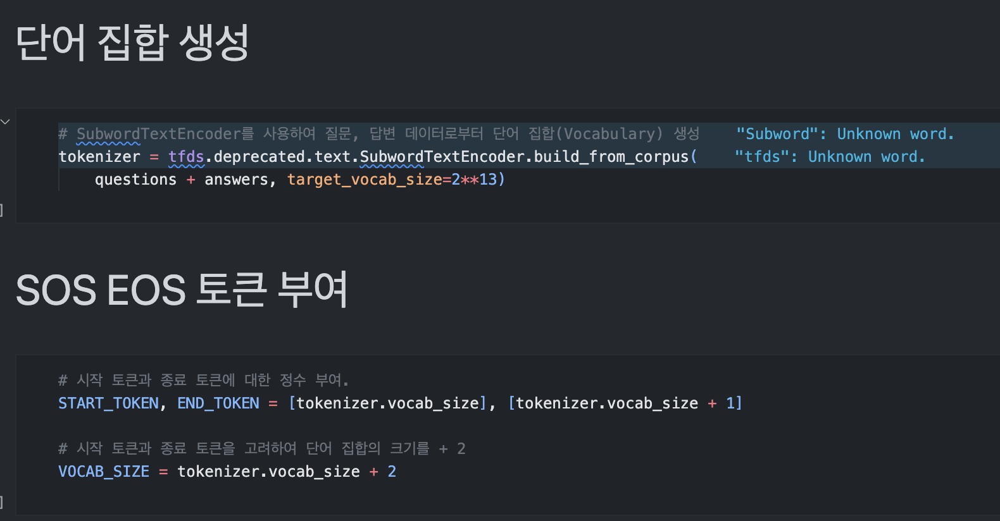

# AIFFEL Campus Online 5th Code Peer Review Templete
- 코더 : 박영준
- 리뷰어 : 본인의 이름을 작성하세요.


# PRT(PeerReviewTemplate) 
각 항목을 스스로 확인하고 토의하여 작성한 코드에 적용합니다.

- [⭕️] 코드가 정상적으로 동작하고 주어진 문제를 해결했나요?
  
- [⭕️] 주석을 보고 작성자의 코드가 이해되었나요?
  > 
- [⭕️] 코드가 에러를 유발할 가능성이 없나요?
  > 정상적으로 동작하고, 에러를 유발할 가능성은 없어보인다.

- [⭕️] 코드 작성자가 코드를 제대로 이해하고 작성했나요?

- [⭕️] 코드가 간결한가요?
  > 모델을 구성하기 위한 코드로 이루어져있으며, 코드의 간결함을 판단하는 것은 어려움이 있음

# 예시
1. 코드의 작동 방식을 주석으로 기록합니다.
2. 코드의 작동 방식에 대한 개선 방법을 주석으로 기록합니다.
3. 참고한 링크 및 ChatGPT 프롬프트 명령어가 있다면 주석으로 남겨주세요.
```python
# 사칙 연산 계산기
class calculator:
    # 예) init의 역할과 각 매서드의 의미를 서술
    def __init__(self, first, second):
        self.first = first
        self.second = second
    
    # 예) 덧셈과 연산 작동 방식에 대한 서술
    def add(self):
        result = self.first + self.second
        return result

a = float(input('첫번째 값을 입력하세요.')) 
b = float(input('두번째 값을 입력하세요.')) 
c = calculator(a, b)
print('덧셈', c.add()) 
```

# 참고 링크 및 코드 개선
```python
데이터 전처리 개선:

현재 코드에서는 주어진 데이터에 대한 큰 전처리가 없습니다. 이외에도 오타 수정, 불필요한 토큰 제거, 형태소 분석기 사용 등 다양한 전처리 방법을 고려해볼 수 있습니다.
하이퍼파라미터 튜닝:

NUM_LAYERS, D_MODEL, NUM_HEADS, UNITS, DROPOUT 등의 하이퍼파라미터 값들은 실험적으로 최적값을 찾을 필요가 있습니다. 주어진 값은 특정 설정에 기반한 것이므로 다양한 조합으로 실험하여 성능을 향상시킬 수 있습니다.
Early Stopping:

모델 훈련 시, 검증 데이터에 대한 성능이 일정 에폭 동안 개선되지 않으면 훈련을 조기 종료하는 '조기 종료(Early Stopping)' 기법을 사용하면 과적합을 방지하고 훈련 시간을 단축시킬 수 있습니다.
체크포인트 저장:

모델 훈련 중 중간 중간에 체크포인트를 저장하여, 나중에 이 체크포인트에서 훈련을 재개하거나 최적의 모델을 불러올 수 있습니다.
정규화:

모델에 과적합을 방지하기 위해 L1, L2 정규화 등을 적용해볼 수 있습니다.
데이터 증강:

현재 사용된 데이터 외에도 다양한 대화 데이터를 수집하거나, 기존 데이터를 변형하여 데이터를 증강시키면 모델의 일반화 성능을 향상시킬 수 있습니다.
후처리:

모델의 출력 문장에서 불필요한 토큰이나 반복되는 단어 등을 제거하는 후처리 과정을 추가하여 응답의 질을 향상시킬 수 있습니다.
```
